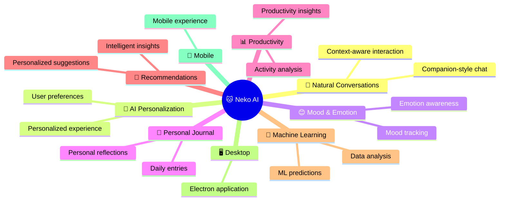
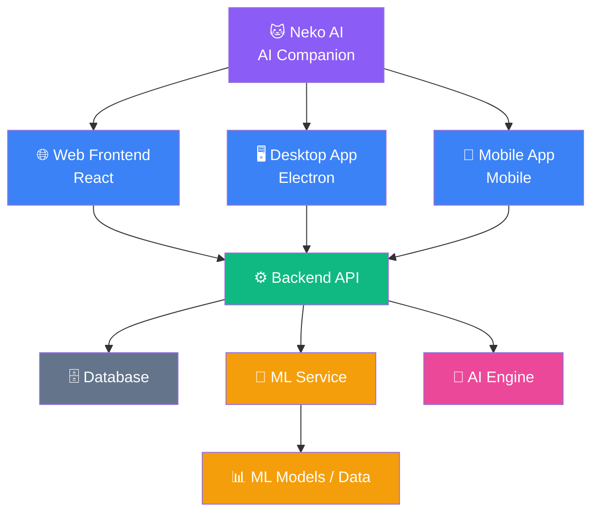
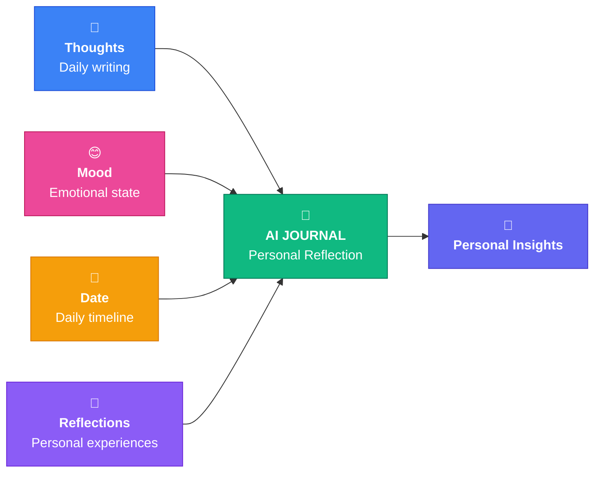

<div align="center">

<h1>🐱 Neko AI</h1>

<h3>✨ Your Intelligent AI Companion ✨</h3>

<p>
An AI-powered personal companion designed to understand your
<b>conversations</b>, <b>emotions</b>, <b>productivity patterns</b>,
and <b>daily experiences</b>.
</p>

<p>


</p>

</div>

---

💜 **Meet Neko**

> 🐾 **Neko isn't just here to answer questions.**  
> Neko is designed to become part of your everyday digital life.

<details>
<summary>💬 <b>Talk with Neko</b></summary>

<br>

Have natural conversations with your AI companion.

Neko provides a conversational interface where users can interact
with the system, ask questions, share thoughts, and build an
ongoing interaction experience.

</details>

<details>
<summary>😊 <b>Express Your Mood</b></summary>

<br>

Your day isn't just about productivity.

Neko AI includes mood-aware features that allow users to record
and reflect on their emotional state alongside their daily activities.

</details>

<details>
<summary>📔 <b>Write Your Day</b></summary>

<br>

Use the AI Journal to record:

📝 **Thoughts**  
😊 **Mood**  
📅 **Daily experiences**  
💭 **Personal reflections**

Your journal becomes a personal space for documenting everyday experiences.

</details>

<details>
<summary>📊 <b>Understand Your Productivity</b></summary>

<br>

Neko AI includes a machine-learning component designed to analyze
productivity-related activity patterns.

The ML pipeline processes activity data, extracts relevant features,
and generates productivity-related predictions.

</details>

<details>
<summary>🧠 <b>Turn Data Into Intelligence</b></summary>

<br>

Neko AI combines different sources of interaction — conversations,
mood, journaling, and activity — into a more intelligent personal
experience.

<br>

<b>👤 User Interaction → 📊 Data → 🧠 ML Analysis → 💡 Insights → 🎯 Personalized Experience</b>

</details>

---------------------------------------------------------------------------------------------------

💙 **What Makes Neko Different?**

<div align="center">

<h3>🌈 What Makes Neko Different? 🐱</h3>

<table>
<tr>
<th>🤖 Traditional Chatbot</th>
<th>🐱 Neko AI</th>
</tr>

<tr>
<td>

</td>
<td>

</td>
</tr>

<tr>
<td>

</td>
<td>

</td>
</tr>

<tr>
<td>

</td>
<td>

</td>
</tr>

<tr>
<td>

</td>
<td>

</td>
</tr>

<tr>
<td>

</td>
<td>

</td>
</tr>

<tr>
<td>

</td>
<td>

</td>
</tr>

<tr>
<td>

</td>
<td>

</td>
</tr>

</table>

</div>

🌈 **The Neko Experience**

<div align="center">

```text
                 🐱 NEKO AI
          ✨ Your Intelligent Companion ✨
                    │
       ┌────────────┼────────────┐
       ↓            ↓            ↓
    💬 CHAT       😊 MOOD      📔 JOURNAL
       │            │            │
       └────────────┼────────────┘
                    ↓
             📊 USER ACTIVITY
                    ↓
             🧠 ML ANALYSIS
                    ↓
             💡 INSIGHTS
                    ↓
          🎯 PERSONAL EXPERIENCE
--------------------------------------------------------------------------------------------------
---------------------------------------------------------------------------------------------------

**✨ Why Neko AI?**

Most AI assistants focus primarily on answering questions.

**Neko AI focuses on the person behind the conversation.**

## 🌟 What Makes Neko AI Different?



The project explores how AI can move from a simple **question → answer** system toward a more **context-aware personal companion**.

-------------------------------------------------------------------------------------------------
---------------------------------------------------------------------------------------------------

**🚀 Features**

**💬 AI Companion**

Interact with Neko AI through a conversational interface designed for natural and engaging interactions.

**Features include:**

* AI-powered conversations
* Conversation history
* Context-aware interactions
* Personalized responses
* Companion-style interaction
---------------------------------------------------------------------------------------------------
--------------------------------------------------------------------------------------------------
**🏗️ System Architecture**

Neko AI follows a modular architecture separating the user interface, backend services, machine-learning components, and platform-specific applications.


---------------------------------------
--------------------------------------------------------------------------------------------------
**😊 Mood & Emotion Tracking**

Neko AI allows users to record and track their emotional state.

Users can:

* Select their current mood
* Record how they are feeling
* Track mood patterns
* Connect journal entries with moods
* Visualize emotional trends

This creates a foundation for understanding how a user's mood changes over time.

---------------------------------------------------------------------------------------------------
---------------------------------------------------------------------------------------------------
**📔 AI Journal**


The journal system allows users to capture their daily thoughts, emotions, and personal experiences.



**📝 Journal Flow**

```text
📝 Thoughts ──────┐
😊 Mood ──────────┤
📅 Date ──────────┼──→ 📔 AI JOURNAL ──→ 🧠 Personal Insights
💭 Reflections ───┘
```


And it communicates the idea that the journal isn't **just a text-storage feature** — it brings together the user's **thoughts + mood + time + reflections** into a personal record.
The long-term goal is to use these entries to provide meaningful personalized insights.

---------------------------------------------------------------------------------------------------
----------------------------------------------------------------------------------------------------
**📊 Productivity Intelligence**

Neko AI includes a machine-learning component designed to analyze
productivity-related patterns in user activity.

**🔄 Productivity Analysis Pipeline**

👤 User Activity
        ↓
📊 Activity Data
        ↓
⚙️ Data Preprocessing
        ↓
🧩 Feature Engineering
        ↓
🧠 Trained ML Model
        ↓
🔮 Prediction
        ↓
💡 Productivity Insight

---------------------------------------------------------------------------------------------------
----------------------------------------------------------------------------------------------------
**🧠 Machine Learning Pipeline**

The ML component follows a standard machine-learning workflow:

Raw Dataset
     ↓
Data Cleaning
     ↓
Feature Engineering
     ↓
Train / Test Split
     ↓
Model Training
     ↓
Model Evaluation
     ↓
Model Serialization
     ↓
Backend Integration
     ↓
Prediction

---------------------------------------------------------------------------------------------------
----------------------------------------------------------------------------------------------------

**🖥️ Desktop Application**

Neko AI includes an **Electron-based desktop experience**, allowing the application to run as a native-style desktop application rather than being limited to the browser.

---------------------------------------------------------------------------------------------------
----------------------------------------------------------------------------------------------------
**📱 Mobile Application**

The project also contains a mobile application component, allowing the Neko AI experience to be extended beyond the desktop/web environment.


---------------------------------------------------------------------------------------------------
----------------------------------------------------------------------------------------------------

**🛠️ Tech Stack**


| Layer            | Technology              |
| ---------------- | ----------------------- |
| Frontend         | React                   |
| Backend          | Node.js / Backend APIs  |
| Database         | SQLite / database layer |
| Machine Learning | Python                  |
| ML Models        | Scikit-learn            |
| Desktop          | Electron                |
| Mobile           | Mobile application      |
| Styling          | CSS                     |
| Icons            | Lucide                  |
| Version Control  | Git & GitHub            |

> The exact technologies can be updated as the project evolves.

---------------------------------------------------------------------------------------------------
----------------------------------------------------------------------------------------------------

**📁 Project Structure**

<table>
<tr>
<th>📂 Directory</th>
<th>🎯 Purpose</th>
</tr>

<tr>
<td>🖥️ <b>backend/</b></td>
<td>Backend services and APIs</td>
</tr>

<tr>
<td>📊 <b>dataset/</b></td>
<td>Datasets and data resources</td>
</tr>

<tr>
<td>📚 <b>docs/</b></td>
<td>Project documentation</td>
</tr>

<tr>
<td>💻 <b>electron/</b></td>
<td>Desktop application</td>
</tr>

<tr>
<td>🎨 <b>frontend/</b></td>
<td>React web application</td>
</tr>

<tr>
<td>🧠 <b>ml_model/</b></td>
<td>Machine learning pipeline and models</td>
</tr>

<tr>
<td>📱 <b>mobile_app/</b></td>
<td>Mobile application</td>
</tr>

<tr>
<td>⚙️ <b>.gitignore</b></td>
<td>Git ignored files and folders</td>
</tr>

<tr>
<td>📖 <b>README.md</b></td>
<td>Project documentation and overview</td>
</tr>

</table>

---------------------------------------------------------------------------------------------------
----------------------------------------------------------------------------------------------------

**🧩 Core Modules**

** 🤖 AI Companion**


 **😊 Emotional Intelligence**


** 📔 Journal**


 **📊 Productivity Intelligence**


**🧠 Machine Learning**


**🌐 Multi-platform**


---------------------------------------------------------------------------------------------------
----------------------------------------------------------------------------------------------------


This separation allows the machine-learning component to evolve independently from the main application.

---------------------------------------------------------------------------------------------------
----------------------------------------------------------------------------------------------------

**🔐 Privacy & Security**

Neko AI is designed with privacy and responsible AI usage in mind.

The project aims to:

* Keep personal data separated from application logic
* Avoid committing secrets to Git
* Keep sensitive configuration in environment variables
* Prevent local database files from being unnecessarily tracked
* Separate datasets from production application code

**Never commit API keys, passwords, tokens, `.env` files, or private datasets to the repository.**

---------------------------------------------------------------------------------------------------
----------------------------------------------------------------------------------------------------

**⚙️ Getting Started**

**## Prerequisites**

Make sure you have installed:

* Node.js
* npm
* Python 3.x
* Git

---------------------------------------------------------------------------------------------------
----------------------------------------------------------------------------------------------------

**1. Clone the repository**


git clone https://github.com/anushka122-raj/neko-ai.git

cd neko-ai

---------------------------------------------------------------------------------------------------
----------------------------------------------------------------------------------------------------

**2. Install frontend dependencies**


cd frontend
npm install


---------------------------------------------------------------------------------------------------
----------------------------------------------------------------------------------------------------

**3. Start the frontend**


npm run dev


or use the appropriate command defined in the project's `package.json`.

---------------------------------------------------------------------------------------------------
----------------------------------------------------------------------------------------------------

**4. Setup backend**

cd backend


Create and activate a Python virtual environment if the backend uses Python:


python -m venv .venv

Windows:


.venv\Scripts\activate

Install dependencies:


pip install -r requirements.txt


Then start the backend using the project's configured entry point.

---------------------------------------------------------------------------------------------------
----------------------------------------------------------------------------------------------------

**🖼️ Screenshots**

> Replace these placeholders with actual screenshots from the application.

**🏠 Dashboard**


**💬 AI Companion**


**😊 Mood Tracking**


**📔 Journal**


**📊 Productivity Insights**


---

**🎥 Demo**

**Live Demo:** Coming Soon

**Demo Video:** Coming Soon

---------------------------------------------------------------------------------------------------
----------------------------------------------------------------------------------------------------

**🗺️ Roadmap**

Neko AI is an evolving project.

**### ✅ Completed / In Progress**

* [x] React-based frontend
* [x] Backend architecture
* [x] AI companion interface
* [x] Journal functionality
* [x] Mood tracking
* [x] ML experimentation
* [x] Desktop application structure
* [x] Mobile application structure
* [ ] 
---------------------------------------------------------------------------------------------------
----------------------------------------------------------------------------------------------------

**🔜 Planned**

* [ ] Long-term conversation memory
* [ ] Advanced emotion detection
* [ ] Personalized AI recommendations
* [ ] Improved productivity prediction
* [ ] AI-generated daily summaries
* [ ] Voice interaction
* [ ] Real-time notifications
* [ ] Better ML evaluation
* [ ] Production database
* [ ] Authentication and authorization improvements
* [ ] Cloud deployment
* [ ] Automated testing
* [ ] CI/CD pipeline
* [ ] Monitoring and logging

---------------------------------------------------------------------------------------------------
----------------------------------------------------------------------------------------------------

**🧪 Testing**

Testing will cover multiple layers of the system:


Frontend
   ↓
Component Testing
   ↓
API Testing
   ↓
Backend Testing
   ↓
ML Model Evaluation
   ↓
End-to-End Testing


As the project moves toward production, automated testing and CI/CD will be added.

---------------------------------------------------------------------------------------------------
----------------------------------------------------------------------------------------------------

**📚 What I Learned**

Building Neko AI has been an opportunity to work across multiple areas of software engineering and AI:

* Full-stack application development
* React architecture
* Backend API development
* Database integration
* Machine-learning pipelines
* Data preprocessing
* Model training and evaluation
* AI application design
* Desktop application development
* Mobile application architecture
* Git and GitHub workflows
* Project architecture and documentation

The project also helped me understand an important distinction:

> **Building an AI product is not only about the AI model — it is about integrating AI into a reliable software system.**

---------------------------------------------------------------------------------------------------
----------------------------------------------------------------------------------------------------

**🔮 Future Vision**

The long-term goal of Neko AI is to evolve into a **personal AI companion platform** capable of understanding different aspects of a user's daily life while keeping the user in control of their data.

Future versions may combine:


**Conversation
     +
Memory
     +
Mood
     +
Journal
     +
Productivity
     +
Personalization
     ↓
┌──────────────────────┐
│   PERSONAL AI         │
│     COMPANION         │
└──────────────────────┘**

---------------------------------------------------------------------------------------------------
----------------------------------------------------------------------------------------------------

**🤝 Contributing**

Contributions, suggestions, and ideas are welcome.

If you would like to contribute:

1. Fork the repository
2. Create a feature branch
3. Make your changes
4. Test your changes
5. Commit your work
6. Open a Pull Request

---------------------------------------------------------------------------------------------------
----------------------------------------------------------------------------------------------------

**📄 License**

This project is currently intended primarily as a personal learning and portfolio project.

Add a formal open-source license here if you decide to distribute the project under one.

---------------------------------------------------------------------------------------------------
----------------------------------------------------------------------------------------------------

**👩‍💻 Author**

**### Anushka Raj**

B.Tech Student | AI & ML Enthusiast | Full-Stack Developer

Interested in building practical AI systems that combine **machine learning, software engineering, and real-world applications**.

**### Connect**

* GitHub: [anushka122-raj](https://github.com/anushka122-raj)

---------------------------------------------------------------------------------------------------
----------------------------------------------------------------------------------------------------

